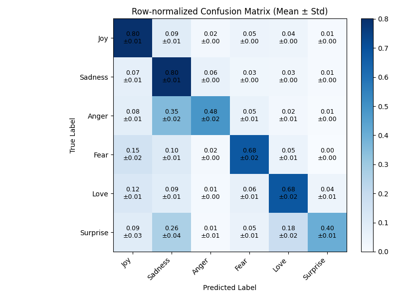
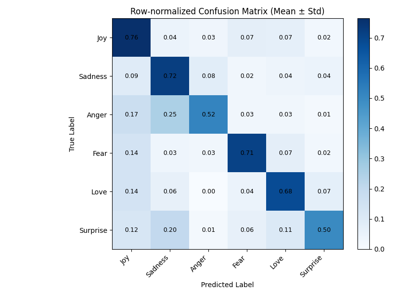
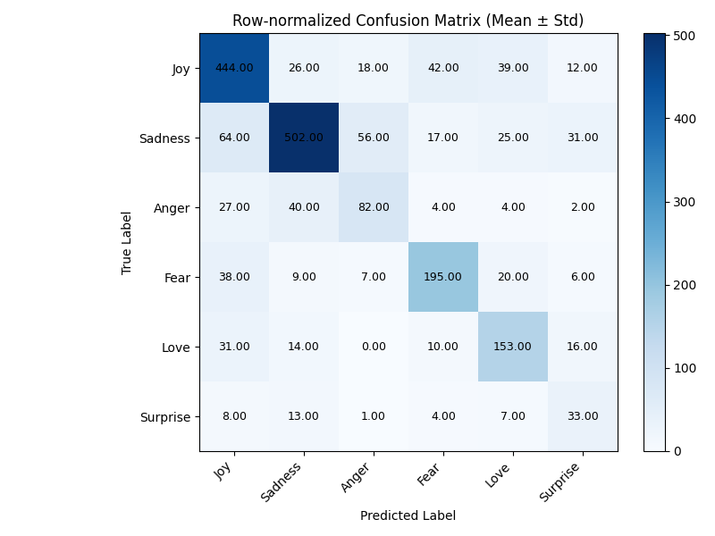

# Emotion Classification: Supervised vs. Zero-Shot

Comparison of two Transformer-based approaches to emotion classification on the
[`dair-ai/emotion`](https://huggingface.co/datasets/dair-ai/emotion) dataset:

1. **Supervised.** Pretrained sentence-transformer models are used as frozen
   feature extractors. A lightweight classification head (a Multi-Layer
   Perceptron or a multinomial Logistic Regression) is trained on top of the
   precomputed embeddings.
2. **Zero-shot.** Natural Language Inference (NLI) models classify each sample
   without any task-specific training, by phrasing every emotion label as a
   natural-language hypothesis.

Both methods are evaluated on the same test set so their accuracy, macro F1, and
characteristic error patterns can be compared directly. This work was developed
as the second practical assignment (TP2) of a Deep Learning course.

## Dataset

`dair-ai/emotion` contains short English text samples, primarily from Twitter,
each labelled with one of six emotions: `joy`, `sadness`, `anger`, `fear`,
`love`, and `surprise`. The dataset is downloaded automatically at runtime
through the Hugging Face `datasets` library, split into train, validation, and
test sets.

## Repository structure

```
.
├── src/                     Main project source code
│   ├── main.py              Entry point: runs Part 1 (supervised) or Part 2 (zero-shot)
│   ├── dataloader.py        Dataset loading, embedding model loading, PyTorch DataLoaders
│   ├── transformer_classifier.py  Embedding computation, ANN and LogReg heads, evaluation
│   ├── nli.py               Zero-shot NLI classification pipeline
│   └── plot_covariance.py   Standalone script to plot a confusion matrix figure
├── notebooks/               Course lab notebooks
│   ├── P4_word_embeddings_seq2seq.ipynb   Word2Vec / GloVe / FastText and seq2seq
│   ├── P5_transformers.ipynb              Transformers on a toy corpus
│   ├── P6_gnn_vs_ann.ipynb                Graph neural networks vs a plain ANN
│   └── P7_reinforcement_learning_taxi.ipynb   Q-learning on Taxi-v3
├── report/                  LaTeX report (Springer LNCS template) and figures
│   ├── samplepaper.tex      Report source
│   └── samplepaper.pdf      Compiled report
├── docs/                    Assignment statement and original starter template
├── data/                    Generated caches: embeddings, labels, analysis dumps (git-ignored)
├── requirements.txt
└── README.md
```

## Setup

Requires Python 3.10 or newer. A GPU is recommended for the zero-shot models but
not required; the code falls back to CPU automatically.

```bash
python -m venv .venv
source .venv/bin/activate
pip install -r requirements.txt
```

## Usage

All commands are run from the `src/` directory so the local module imports
resolve:

```bash
cd src
python main.py
```

The behaviour is selected inside `main.py` by editing the calls at the bottom of
the file:

- `part_one(head_type="ann")` runs the supervised pipeline with the MLP head.
- `part_one(head_type="logreg")` runs the supervised pipeline with the Logistic
  Regression head.
- `part_two()` runs the zero-shot NLI classification.

### Part 1: Supervised

`part_one` encodes every split with the sentence-transformer model configured by
`MODEL_NAME` in `dataloader.py`, caches the embeddings and labels as `.npy`
files, then trains the chosen head. The MLP head uses early stopping on the
validation macro F1 score. To reduce variance, training is repeated over
`N_SEEDS` seeds and the reported accuracy, macro F1, and confusion matrices are
averaged across runs.

### Part 2: Zero-shot

`part_two` loads a zero-shot NLI model from the Hugging Face Hub and classifies
the test set using the hypothesis template `"This text expresses {}."`. It prints
the accuracy, macro F1, and confusion matrix, and writes every misclassified
sample to `misclassified_nli.txt` for error analysis. The model is selected by
the `model_name` argument.

### Plotting

`plot_covariance.py` renders a row-normalized confusion matrix (mean and standard
deviation across seeds) as a heatmap. The matrix values are hard-coded from a
previous run; update them to visualize new results.

```bash
python src/plot_covariance.py
```

## Configuration

Key hyperparameters and model choices are defined as constants near the top of
each module:

| Setting | Location | Notes |
| --- | --- | --- |
| Embedding model | `MODEL_NAME` in `dataloader.py` | Any `sentence-transformers` model |
| Training batch size | `BATCH_SIZE_TRAIN` in `dataloader.py` | |
| Epochs, learning rate | `EPOCHS`, `LR` in `transformer_classifier.py` | |
| Early stopping patience | `EARLY_STOPPING_PATIENCE` in `transformer_classifier.py` | |
| Number of seeds | `N_SEEDS` in `main.py` | Runs averaged for stability |
| Zero-shot model | `model_name` in `main.py` `part_two` | Any NLI zero-shot model |
| Random seed | `SEED` in `dataloader.py` | Shared across parts for reproducibility |

## Results

Row-normalized confusion matrices on the test set, mean and standard deviation
across seeds, for the supervised ANN head and the zero-shot NLI model.

| Supervised (ANN head) | Zero-shot (NLI) |
| --------------------- | --------------- |
|  |  |

Both approaches handle `joy` and `sadness` well and struggle with the two rarest
labels. The supervised model leaks `anger` and `surprise` into `sadness`; the
zero-shot model makes a different set of mistakes, driven by how each emotion word
reads as an NLI hypothesis rather than by class frequency.

The same matrices in raw counts, which make the class imbalance visible:

| Supervised (ANN head) | Zero-shot (NLI) |
| --------------------- | --------------- |
|  |  |

## Report

A full write-up of the methodology, experiments, and results is in
[`report/samplepaper.pdf`](report/samplepaper.pdf), titled "Emotional Models:
Supervised vs. Zero-Shot Classification". Key findings include:

- The ANN head consistently outperforms Logistic Regression, indicating the
  embedding spaces are not linearly separable for this task.
- Among the supervised embedding models, `all-MiniLM-L6-v2` scored highest
  despite being the smallest, likely due to reduced overfitting.
- Zero-shot performance depends heavily on how each NLI model was pretrained;
  models trained specifically for zero-shot classification on emotion and
  sentiment data outperform generic or multilingual NLI models.
- Dataset label noise (for example, "I didn't feel humiliated" labelled as
  sadness) caps the achievable performance for both approaches.

## Notebooks

The `notebooks/` directory holds the course lab exercises. `P4` and `P5` cover the
embedding and Transformer material that this project builds on directly; `P6` and
`P7` are later sessions on other deep learning topics, kept here alongside them.

- `P4_word_embeddings_seq2seq.ipynb`: builds small Word2Vec, GloVe, and
  FastText-like models and compares their embedding manifolds.
- `P5_transformers.ipynb`: works through Transformer components on a toy corpus.
- `P6_gnn_vs_ann.ipynb`: compares a graph neural network against a plain ANN.
- `P7_reinforcement_learning_taxi.ipynb`: trains a Q-learning agent on Taxi-v3.

These are self-contained and independent of the main `src/` project.

## Authors

- Miguel Castela
- Miguel Martins

University of Coimbra, Portugal.
